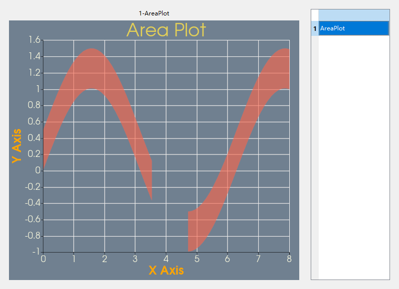
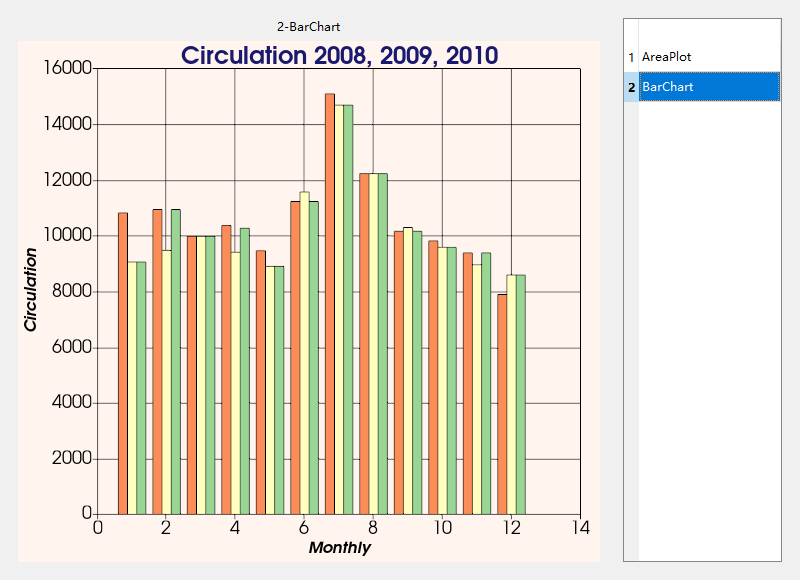
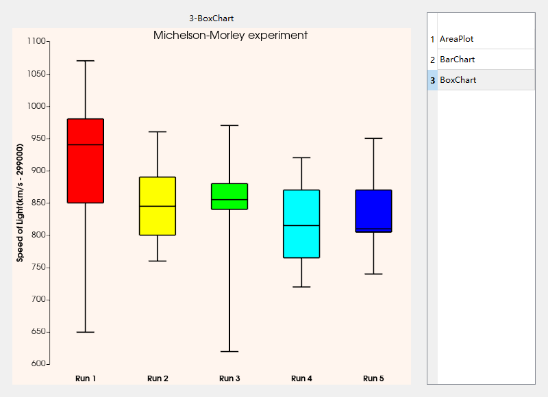

# Tip

- [Tip](#tip)
- [1-AreaPlot](#1-areaplot)
- [2-BarChart](#2-BarChart)
- [3-BoxChart](#3-BoxChart)

# 1-AreaPlot

[回到顶部](#Tip)

# 2-BarChart

[回到顶部](#Tip)

# 3-BoxChart

[回到顶部](#Tip)

[learn](./examples/readme_3箱线图.md)

